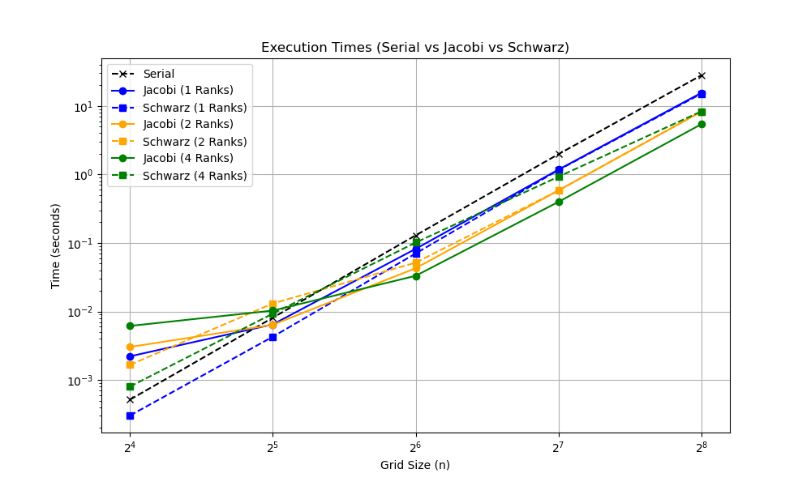
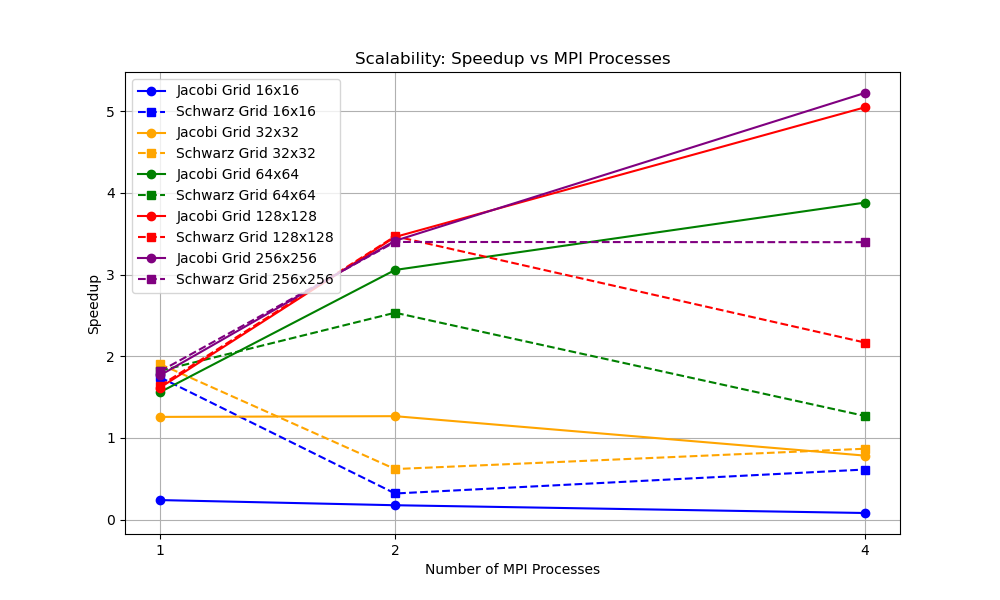
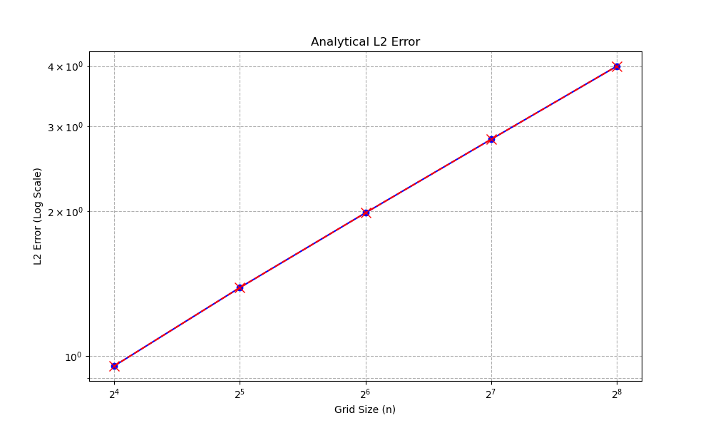

# Scalability and Performance Analysis

## Overview
In this document we discuss the performance of the hybrid MPI + OpenMP solver for the 2D Poisson equation. 
In particular, the benchmark compares a Parallel Jacobi solver and Parallel Block Jacobi (Schwarz) solver.

## Environment
The tests were executed on a machine with an 8-core processor (see test/data/hw.info).
We used these parameters:
* **Grid Size**: $N = 2^k \times 2^k$ with $k \in \{4, 5, 6, 7, 8\}$ (grid from 16x16 to 256x256);
* **MPI Ranks**: 1, 2, 4;
* **OpenMP Threads**: 2 per each MPI rank;
* **Max Iterations**: 50000 for Jacobi, 2000 global iterations for Schwarz.

## Results Analysis

### Execution Times

This plot highlights the problem of **Communication Overhead**: 
* **Small grids**: for $N \le 32$ the serial algorithm (black dashed line) outperforms the parallel configurations, particularly the 4-rank setup.
Indeed, for coarse grids the CPU time spent initializing OpenMP and communicating via MPI dominates the operations required by small domains. 
* **Break point**: at $N = 64$ each configuration of the parallel solvers outperform the serial version
* **Scalability**: at $N = 256$ the performance starts scaling inversely with the number of MPI ranks
* **Schwarz**: the Schwarz solver with 4 ranks becomes noticeably slower than Jacobi (green lines); this is due to the fact that block Jacobi solvers are locally solving a problem that is globally incorrect (the boundary values are propagated only at the end of each global iteration) and the narrowness of the 4 subdomains makes the information propagation more difficult.

### Speedup Analyis

This plot shows the limits of Additive Schwarz Methods without overlapping domains: the parallel Jacobi solver reaches more than 5x speedup on the 256x256 grid, whereas the Block Jacobi solver drops in performance as discussed before. 
This phenomenon is not due to an implementation error, but due to the mathematical behavior of the algorithm: this kind of problems have infinite propagation speed, but the block structure enforces local iterations and forcing the solver to perform more computations to solve the global problem. 

### L2 Error

